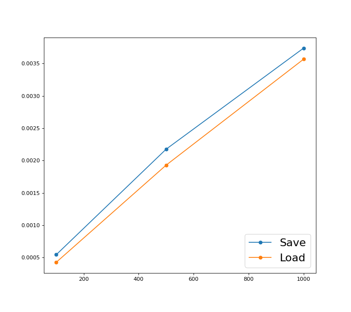

# Persistent-world

Persistent world on Boost.Serialization + catch2 v3 

[**catch2**](https://github.com/catchorg/Catch2/blob/master/docs/benchmarks.md) 

[**Boost.Serialization**](https://www.boost.org/doc/libs/1_72_0/libs/serialization/doc/tutorial.html)

Люди исследуют планеты, соединённые порталами. Каждый портал двусторонний и соединяет две планеты. Планета характеризуется именем, цветом и имеющимися на ней порталами (минимум 1).Каждый портал соединён с порталом на другой планете, соединения двунаправленные и стабильные,но до первого прохода через портал его местоназначение неизвестно.Игрок начинает на домашней планете. Попадая на планету, разведка предоставляет все её характеристики.Каждый ход игрок указывает, в какой портал идёт дальше. Первый проход через не исследованный порталможет вывести на один из не исследованных порталов на других известных планетах, или на новую планету.Реализовать путешествие по подобным образом устроенному миру с возможностью выхода из программыс сериализацией известной части мира в файл, чтобы десериализовать при следующем запуске. Сериализация через **Boost.Serialization.**

Отчет: 

[https://github.com/disc0nn3ct/Persistent-world/blob/main/LOG_catch2v3.txt](LOG_catch2v3.txt) 

